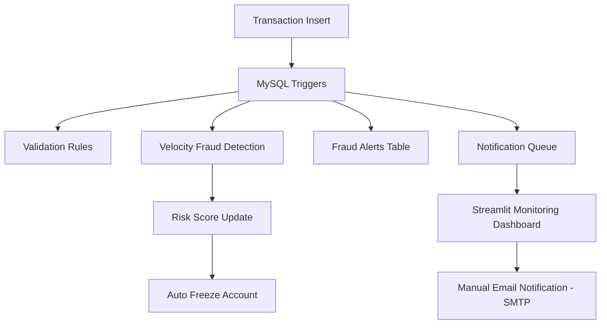

# Bank Fraud Detection Using SQL Triggers

This project implements a production-inspired, real-time banking fraud detection and monitoring system by embedding core fraud rules directly into the MySQL database layer using SQL triggers. By enforcing validation, fraud detection, and risk controls at the data layer, the system ensures low-latency decision making, strong consistency, and full auditability, regardless of how transactions are generated or consumed.

To complement database-driven enforcement, the system integrates Python-based services and a Streamlit monitoring dashboard to provide real-time visibility into fraud events. Suspicious activities are surfaced through dashboards and SMTP-based email alerts, enabling controlled, analyst-driven responses without compromising transaction performance.

## Problem statement

* Banking systems handle large volumes of transactions in real time

* Fraud detection must occur immediately to reduce risk

* Application-only validations are inconsistent and bypassable

* Multiple services often interact with the same database

* Fraud controls need centralized, reliable enforcement

### Objective: 
Build a data driven fraud detection system that operates independently of application logic and guarantees enforcement directly at the database level
## Project workflow

## System Architecture

## Database Schema (MySQL)

The system is built on a relational MySQL schema designed to support real-time fraud detection, risk scoring, and event-driven notifications.

### 📋 `customers`

Stores customer identity information.

| Column Name  | Data Type     | Description                    |
|-------------|---------------|--------------------------------|
| customer_id | CHAR(36) (PK) | Unique customer identifier     |
| full_name   | VARCHAR(100)  | Customer full name             |
| email       | VARCHAR(150)  | Customer email address         |
| created_at  | TIMESTAMP     | Record creation time           |

---

### 🏦 `accounts`

Represents bank accounts and fraud risk posture.

| Column Name      | Data Type        | Description                         |
|------------------|------------------|-------------------------------------|
| account_id       | CHAR(36) (PK)    | Unique account identifier           |
| customer_id      | CHAR(36) (FK)    | Linked customer                     |
| account_status   | VARCHAR(20)      | ACTIVE / FROZEN / RESTRICTED        |
| risk_score       | INT              | Accumulated fraud risk score        |
| daily_txn_limit  | DECIMAL(12,2)    | Daily transaction limit             |
| created_at       | TIMESTAMP        | Account creation time               |

---

### 💳 `transactions`

Captures all monetary movements.

| Column Name        | Data Type        | Description                         |
|--------------------|------------------|-------------------------------------|
| txn_id             | CHAR(36) (PK)    | Transaction identifier              |
| account_id         | CHAR(36) (FK)    | Account involved                    |
| amount             | DECIMAL(12,2)    | Transaction amount                  |
| txn_type           | VARCHAR(20)      | ATM / POS / ONLINE / TRANSFER       |
| merchant_country   | VARCHAR(10)      | Merchant country code               |
| device_id          | VARCHAR(50)      | Device identifier                   |
| txn_timestamp      | TIMESTAMP        | Transaction event time              |

---

### 🚨 `fraud_alerts`

Stores detected fraud signals.

| Column Name   | Data Type                | Description                    |
|---------------|--------------------------|--------------------------------|
| alert_id      | INT (PK, AUTO_INCREMENT) | Alert identifier               |
| account_id    | CHAR(36)                 | Impacted account               |
| rule_name     | TEXT                     | Fraud rule name                |
| alert_message | TEXT                     | Human-readable message         |
| created_at    | TIMESTAMP                | Detection time                 |

---

### 🔔 `notification_queue`

Event emission table for downstream systems.

| Column Name       | Data Type                | Description                    |
|-------------------|--------------------------|--------------------------------|
| notification_id   | INT (PK, AUTO_INCREMENT) | Notification identifier        |
| account_id        | CHAR(36)                 | Impacted account               |
| event_type        | TEXT                     | Event type                     |
| message           | TEXT                     | Notification message           |
| created_at        | TIMESTAMP                | Emission time                  |
| processed         | BOOLEAN                  | Processing status              |
