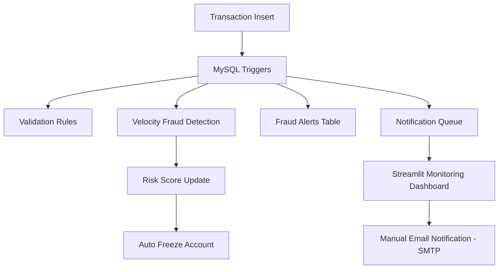

# Bank Fraud Detection Using SQL Triggers

This project implements a production-inspired, real-time banking fraud detection and monitoring system by embedding core fraud rules directly into the MySQL database layer using SQL triggers. By enforcing validation, fraud detection, and risk controls at the data layer, the system ensures low-latency decision making, strong consistency, and full auditability, regardless of how transactions are generated or consumed.

To complement database-driven enforcement, the system integrates Python-based services and a Streamlit monitoring dashboard to provide real-time visibility into fraud events. Suspicious activities are surfaced through dashboards and SMTP-based email alerts, enabling controlled, analyst-driven responses without compromising transaction performance.

## Problem statement

* Banking systems handle large volumes of transactions in real time

* Fraud detection must occur immediately to reduce risk

* Application-only validations are inconsistent and bypassable

* Multiple services often interact with the same database

* Fraud controls need centralized, reliable enforcement

#### Objective: 
Build a data driven fraud detection system that operates independently of application logic and guarantees enforcement directly at the database level
## Project overflow

## System Architecture

